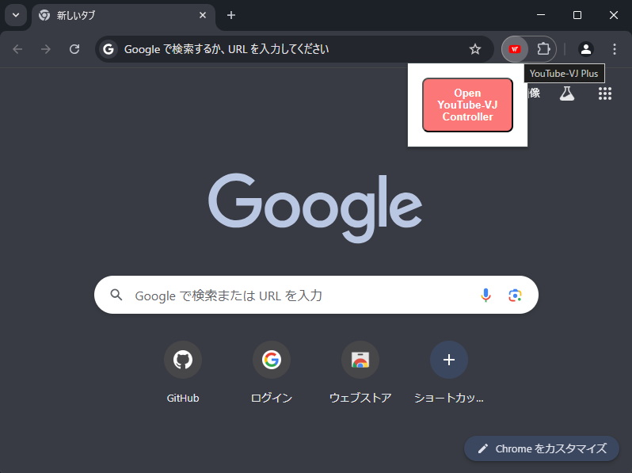
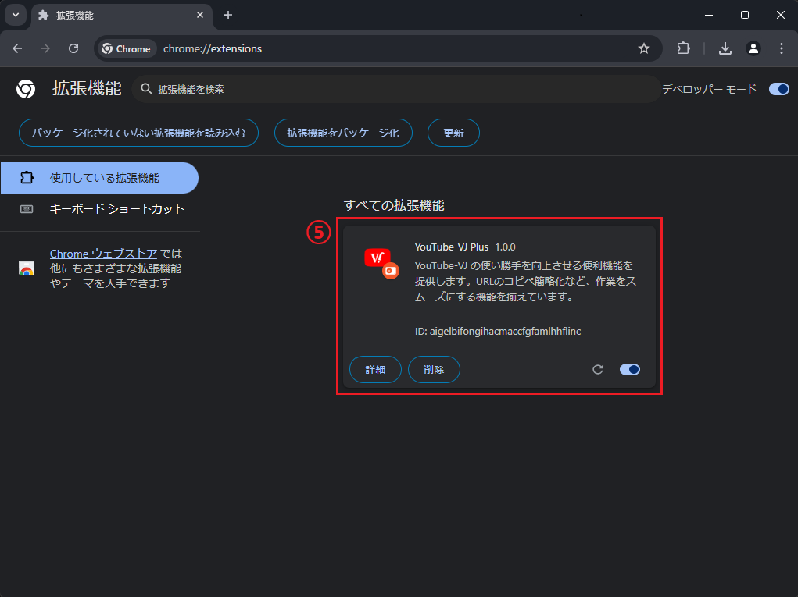
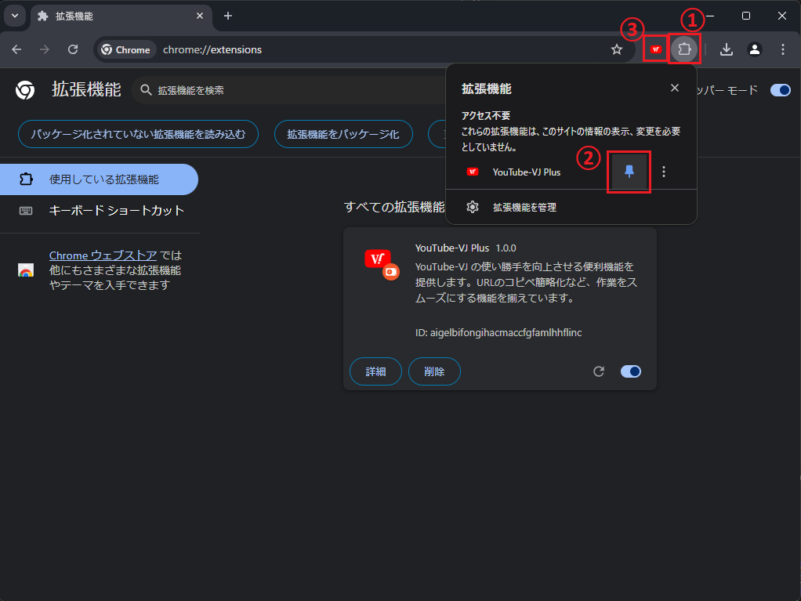

# Chrome 拡張機能の紹介と導入手順

## 拡張機能でできること

### 機能 1: YouTube-VJ をすぐに起動

拡張機能のアイコンをクリックすることで YouTube-VJ のコントローラーウィンドウをすぐに開くことができます

### 機能 2: YouTubeID のコピペ不要に

別タブで YouTube を開き、動画再生をすると自動的に YouTube-VJ にも反映されます

## インストール方法

まだ製作途中というのもあり、Chrome ウェブストアでの公開は行っておりません。

そのため、拡張機能の導入手順が少し複雑になっております。

### 1. 拡張機能のダウンロード

1. [YouTube-VJ_Plus.zip](/YouTube-VJ_Plus.zip)をダウンロードします
2. ダウンロードした ZIP ファイルを任意の場所に展開します

注意：展開したフォルダを拡張機能の導入後に移動や削除等をすると Chrome からも削除されてしまいますのでお気を付けください。

### 2. 開発者モードでのインストール

1. Chrome ブラウザを開き、アドレスバーに `chrome://extensions` を入力
2. 右上の「デベロッパー モード」スイッチをオンにする
3. 「パッケージ化されていない拡張機能を読み込む」をクリック
4. 展開したフォルダ(YouTube-VJ_Plus)を選択
5. 拡張機能に `YouTube-VJ Plus`が追加されることを確認

### 3. YouTube-VJ 拡張機能をピン止めする

1. 右上拡張機能アイコンをクリック
2. YouTube-VJ のピンをクリック
3. 拡張機能アイコンの横に YouTube-VJ が表示されることを確認

## サポート・フィードバック

不具合やバグを発見した場合は、お気軽にご連絡ください

機能改善のご要望も受け付けてます！！！

- [X(@KazuPro_g)](https://x.com/KazuPro_g)の DM
- [YouTube-VJ リポジトリ](https://github.com/KazuProg/youtube-vj)の issues
